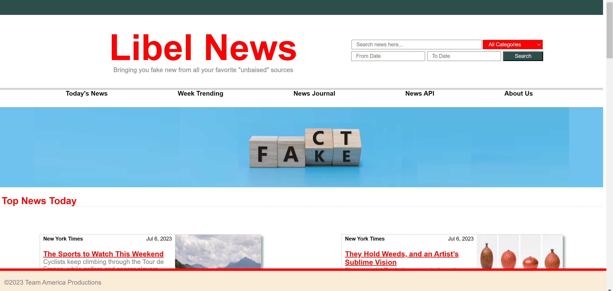
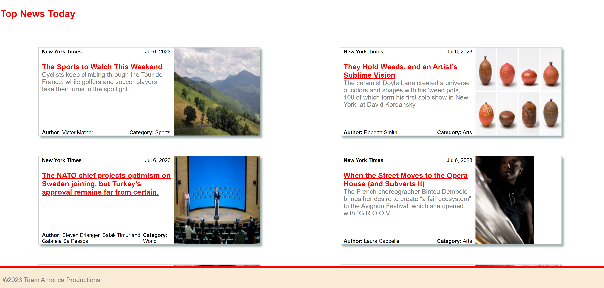
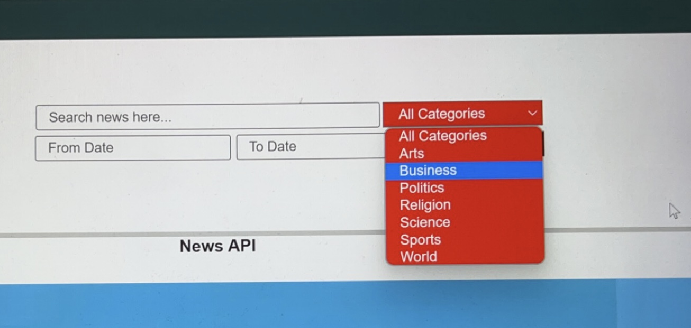
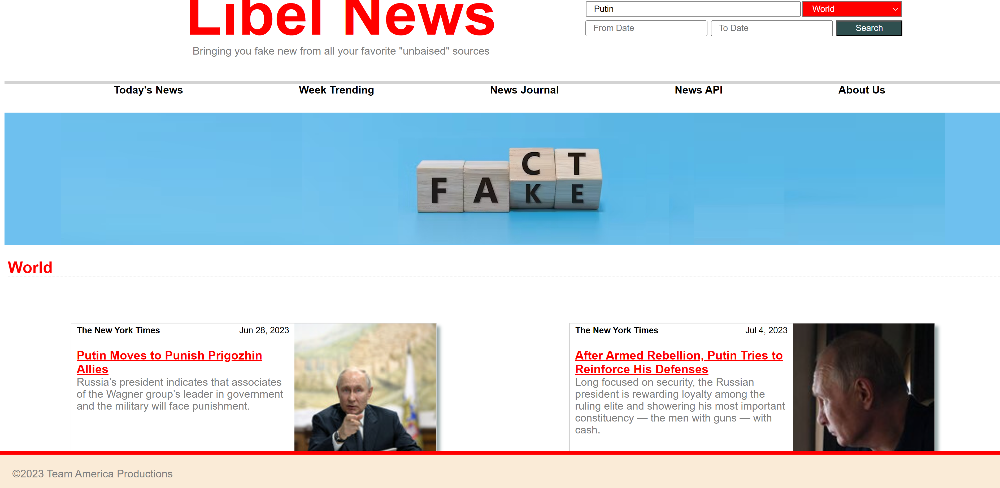
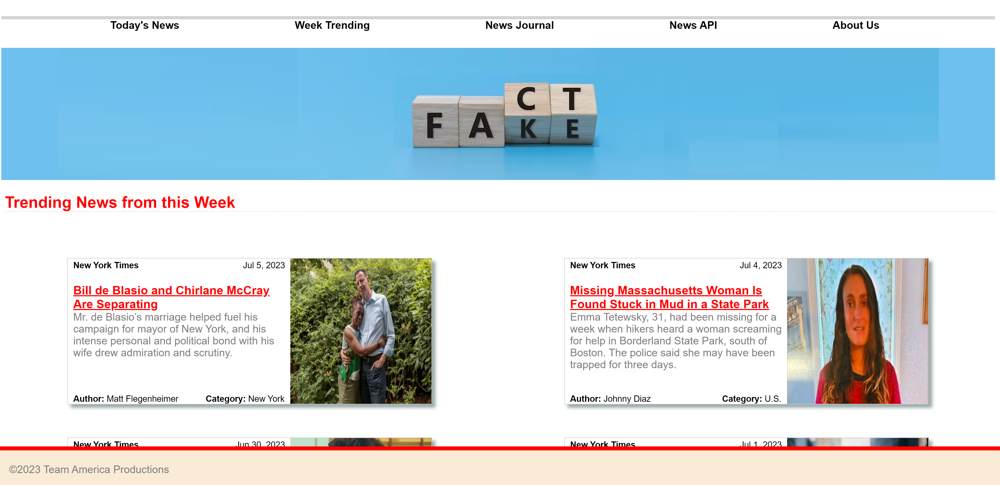
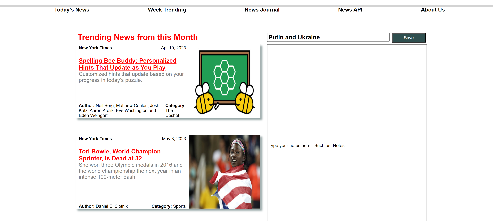
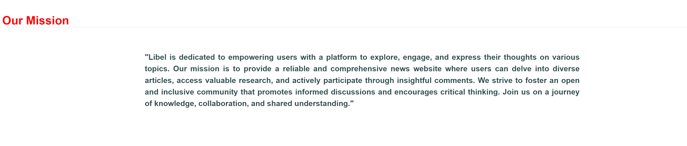

# News Article Search Engine
## Description
Libel is a web application that empowers users to dissect news articles, detect biases, and conduct independent research. Designed with a rich set of features and intuitive user interface, Libel serves as a potent tool in the fight against misinformation and promotes a well-informed society.

The motivation behind Libel was the ever-increasing need to combat the prevalence of misinformation and the declining trust in traditional news outlets. Through advanced natural language processing tools and access to a vast array of news sources, users are equipped with the means to form educated opinions and make informed decisions.

This News article locator API website allows user to easily search for relevant news articles. The user has the ability to search based on criteria such as: keywords, date range, and subject. It also allows the user to select the News Journal tab and write specific notes on what they have read. 

This news search capability is the foundation for news comparison capabilities and follow on NLP work.

## Table of Contents

- [Installation](#installation)
- [Usage](#usage)
- [Screenshots](#screenshots)
- [User Story](#user-story)
- [Credits](#credits)
- [License](#license)
- [Features](#features)

## Installation
This project has no prerequisites for installation. However, to access the site the user must follow the GitHub repository link to access the deployment link and from there will have access to the full functionality of the site.

GitHub Link: https://github.com/rhonvyramos/libel_news_reports/
Deployed Link: https://rhonvyramos.github.io/libel_news_reports/

## Usage
This website is intended for  quick and effcient searching of news articles as well as having the ability to write notes on what was read. Eventually, this site will allow users the ability to compare articles and get an AI generated depiction of sentiment and bias, and users will ahve a full ability to comment on their research.

## Screenshots
Upon loading into the site the user will see this screen

The user can scroll down and will presented with the days top articles

The user will have the ability to input search criteria and can filter it by date and subject

Upon inputting their criteria and clicking search the user will only be shown articles that have the keyword and are of the proper subject

If no result is found the user will be shown a messgae declaring no results are found for that specifc subject within the selected date range

Upon selecting the "Trending This Week" category the user will be able to see top news stories from this week

By clicking the "News Journal" tab the user will be able to view articles while additionally having the ability to write notes regarding what they were reading

The final section is an "About Us" it details the mission of our website and additionally gives a brief bio of the team members

## User Story 
Imagine a user named Sarah who frequently reads news articles online but is aware of the potential biases that exist across different media outlets. Sarah wants to ensure she gets a well-rounded view of current events by considering multiple perspectives. She visits the Libel website and creates an account. Upon logging in, she is greeted with a clean and intuitive interface. Sarah starts by using the advanced search functionality to find articles related to a specific topic she's interested in.  
Libel presents Sarah with a list of articles from various sources, including mainstream media outlets, independent journalists, and opinion pieces. The website's natural language processing tools highlight keywords and phrases in the articles, helping Sarah quickly identify potential biases or discrepancies between sources. She can then compare these articles side by side, making notes and highlighting specific sections for later reference.  
To ensure accuracy, Sarah conducts her own research by using Libel's integrated tools to fact-check statements made in the articles. The website provides access to reliable fact-checking sources and verified information databases, enabling her to make informed decisions about the credibility of the claims being made.  
After conducting her analysis and research, Sarah feels confident in forming her own opinion about the topic at hand. She appreciates Libel's ability to provide her with a platform to compare news stories, conduct research, and reach her conclusions based on a well-informed understanding of the information available. Thanks to Libel, Sarah can navigate the complex media landscape with increased confidence and critical thinking skills.

AS A person searching for specified information
I WANT an easy way to find related news articles
SO THAT I can easily see information that is relevant to my search

## Acceptance Criteria 

GIVEN I am looking for news articles 
WHEN I input keywords relating to my topic of research 
THEN Related news articles will display on my screen 
WHEN I select a category and search 
THEN Only articles that are relivant to that category are displayed 
WHEN I select a specifc date range  
THEN I am only shown articles that fall within that specific date range 
WHEN I access the News Journal tab 
THEN I am able to write notes about articles I have read 
WHEN I access the About Me tab 
THEN I see basic information pertaining to each team member 

 

## Credits

Libel was developed by the followign dedicated team of developers:
Daniel Morante
John Gasiorowski
Rhon Ramos
Jimmy O'Brien

We also utilized third-party APIs that power our advanced search functionalities and natural language processing tools (list of APIs here).

## License

This project is licensed under the terms of the MIT License.

MIT License

Copyright (c) 2023 Your Name

Permission is hereby granted, free of charge, to any person obtaining a copy
of this software and associated documentation files (the "Software"), to deal
in the Software without restriction, including without limitation the rights
to use, copy, modify, merge, publish, distribute, sublicense, and/or sell
copies of the Software, and to permit persons to whom the Software is
furnished to do so, subject to the following conditions:

The above copyright notice and this permission notice shall be included in all
copies or substantial portions of the Software.

THE SOFTWARE IS PROVIDED "AS IS", WITHOUT WARRANTY OF ANY KIND, EXPRESS OR
IMPLIED, INCLUDING BUT NOT LIMITED TO THE WARRANTIES OF MERCHANTABILITY,
FITNESS FOR A PARTICULAR PURPOSE AND NONINFRINGEMENT. IN NO EVENT SHALL THE
AUTHORS OR COPYRIGHT HOLDERS BE LIABLE FOR ANY CLAIM, DAMAGES OR OTHER
LIABILITY, WHETHER IN AN ACTION OF CONTRACT, TORT OR OTHERWISE, ARISING FROM,
OUT OF OR IN CONNECTION WITH THE SOFTWARE OR THE USE OR OTHER DEALINGS IN THE
SOFTWARE.

## Features

Libel comes loaded with features that promote independent research and foster informed decision-making. These include an intuitive user interface, advanced search functionality, natural language processing tools (future capability), the ability to compare stories from various sources (future capability), and features to assist users in identifying biases in news articles (future capability).
